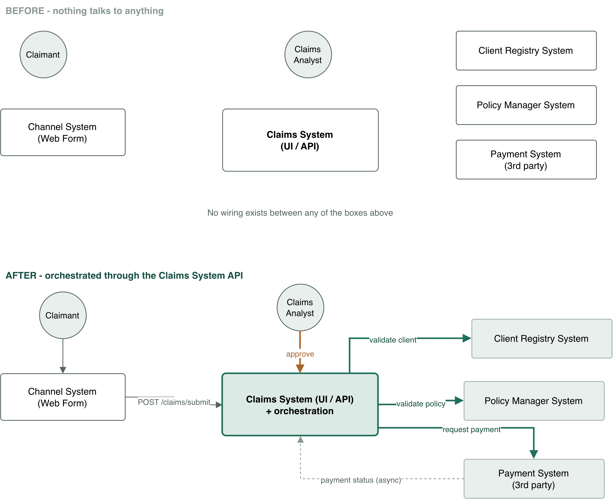
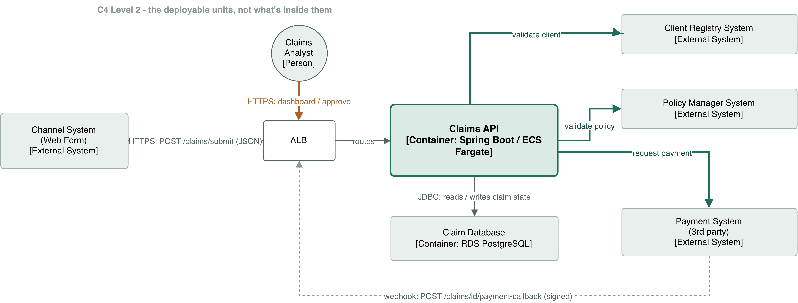
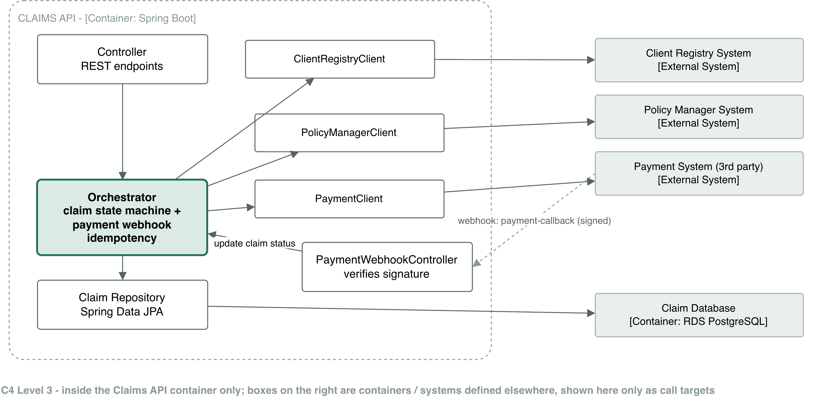
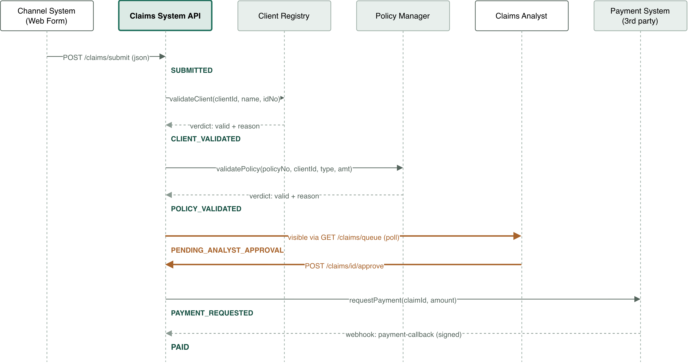

# Claims Processing — Solution Submission

This document is the written submission for the Claims Processing case
study. It covers the solution description, architecture, assumptions,
recommended changes to existing systems, how the systems interact, the
project structure and sample code, and how AI was used while building it.

The reference implementation itself — a working Claims System API with
tests, a Postman collection, and a README covering how to run it — lives in
this same repository. This document explains the *why*; the code
demonstrates the *how*.

## 1. Solution description

Today, four systems exist independently: the Channel System (client-facing
web form), the Claims System (UI + API, not wired to anything), the Client
Registry System, the Policy Manager System, and the Payment System. A client
submits a claim through the Channel System and nothing downstream happens
automatically.

The proposed solution wires these together through the **Claims System
API**, which becomes the orchestrator for the whole claim lifecycle:

1. The Channel System posts the claim to the Claims System API
   (`POST /claims/submit`).
2. The Claims System asks the **Client Registry System** to validate the
   claimant (`validateClient`) and the **Policy Manager System** to
   validate the policy/plan/benefit (`validatePolicy`).
3. If both pass, the claim moves to an analyst queue for approval
   (`PENDING_ANALYST_APPROVAL`) inside the existing Claims System UI.
4. On analyst approval, the Claims System initiates a payment request
   against the **Payment System**.
5. The Payment System processes the payment asynchronously and calls back
   into the Claims System (`POST /claims/{id}/payment-callback`) with the
   outcome, which updates the claim's final status (`PAID` /
   `PAYMENT_FAILED`).

The Claims System owns the workflow state machine end to end; the other
three systems are treated as focused services it calls into, each
responsible for its own domain (client identity/eligibility, policy/benefit
rules, payment execution) and nothing else. No new system or message broker
is introduced — the orchestration is a small, testable state machine inside
the existing Claims System, which matches how the brief's own system
context diagram draws it (one Claims System box, no separate orchestrator).

## 2. Architecture diagrams

Four C4-style diagrams. The editable source is
[`architecture/claims-architecture.drawio`](architecture/claims-architecture.drawio)
(open at [app.diagrams.net](https://app.diagrams.net) or with the
[draw.io VS Code extension](https://marketplace.visualstudio.com/items?itemName=hediet.vscode-drawio)
— GitHub's default file viewer shows it as raw XML, not rendered).
Exported images below for direct viewing.

### 1 — System Context

Before/after: the five systems and how the Claims System API becomes the
hub connecting them.



### 2 — Container Diagram

Deployment shape: ALB → Claims API (ECS Fargate) → RDS PostgreSQL, plus
outbound calls to the three external systems.



### 3 — Component Diagram

Internal structure of the Claims System API: controller → orchestrator →
adapter clients → repository.



### 4 — Claim Sequence

The full request flow for one claim: submit → validate client → validate
policy → analyst approval → payment request → payment webhook.



The sequence diagram matches the actual adapter contracts in code:
`validateClient(clientId, name, idNo) → verdict (valid + reason)` and
`validatePolicy(policyNo, clientId, type, amount) → verdict (valid +
reason)` — see Section 4 for why this is a deliberate design choice, not just an
implementation detail.

A few features finished late in the build aren't drawn on the diagrams —
the `Idempotency-Key` header, duplicate-claim detection, the human-readable
claim reference, optimistic-locking, and the `GET /claims` browse endpoint.
These are additions to the sequence shown, not contradictions of it; they're
described in Section 4 and Section 5 below, and demonstrated in the code and Postman
collection, rather than re-drawn — at this scope a diagram redraw would add
visual noise without adding information the narrative doesn't already
carry.

## 3. Assumptions

- **Analyst identity and authentication are out of scope.** The brief
  describes the Claims System (UI + API) as an *existing* system being
  enhanced, not built from scratch — it already has its own analyst
  accounts, login, and roles. `analystId` is treated as an opaque string
  supplied by the existing UI/session, recorded purely for audit
  (`Claim.approvedByAnalystId`). No `Analyst` table is introduced, since
  building one would mean inventing an identity model for a system that
  already has one.
- **The analyst queue is shared, not per-analyst.** `GET /claims/queue`
  returns every claim awaiting approval, highest priority first, oldest
  first — whichever analyst is free takes the top of the queue. This
  directly serves the brief's requirement that time-sensitive claims (e.g.
  death claims) be processed quickly, without needing a routing/assignment
  system.
- **A policy can have more than one legitimate claim.** There is no
  database-level uniqueness constraint on policy or client — duplicate
  handling is a judgment call surfaced to the analyst (Section 5), not a hard
  rejection.
- **The Client Registry and Policy Manager systems can be called
  synchronously, in real time, during claim submission.** The brief
  supports this ("validations... handled by" those systems as part of
  processing a claim); if either is genuinely slow or unreliable in
  practice, the same interface can be called asynchronously with the claim
  parked in a `SUBMITTED` state until a verdict arrives — nothing in the
  contract would need to change.
- **The Payment System is the system of record for whether money actually
  moved.** The Claims System requests a payment and then waits for the
  Payment System's callback rather than polling or assuming success —
  it never marks a claim `PAID` on the strength of its own request alone.
- **Timestamps are recorded and returned in South African time
  (`Africa/Johannesburg`, fixed `+02:00` — the country doesn't observe
  DST), not UTC.** This is a deliberate choice for a South African
  insurer's internal system, not an oversight: every claim timestamp an
  analyst or claimant sees matches their own wall clock without a
  conversion step. It's stored as an explicit offset (`OffsetDateTime`),
  not a bare local time, so it stays unambiguous and correctly sortable
  even if the deployment later spans multiple time zones.

## 4. Recommended changes to existing systems

The brief asks each existing system to take on a role. The specific
recommendation here is about *how* they expose that role, because it
materially changes how reliable and maintainable the integration is:

- **Client Registry System and Policy Manager System should expose
  verdict-returning validation endpoints, not raw data lookups.** e.g.
  `POST /clients/validate` returning `{ valid: boolean, reason: string? }`,
  rather than `GET /clients/{id}` returning a client record that the Claims
  System then has to interpret. The brief's own wording — client validation
  is "**handled by**" the Client Registry System — supports this: it says
  those systems own the validation *decision*, not just the underlying
  data. Concretely, this means:
  - The business logic ("is this client active," "is this policy's benefit
    sufficient for this claim type") stays inside the system that owns
    that domain and changes independently of the Claims System.
  - The Claims System's job shrinks to *reacting to a verdict*, which is a
    smaller, more stable contract to integrate against and much easier to
    unit test (see `ClaimOrchestratorServiceTest`, which mocks exactly this
    interface).
  - If validation rules change (new benefit types, new eligibility rules),
    only the owning system needs to change — the Claims System's contract
    is untouched.
- **The Channel System's contract to the Claims System should support an
  `Idempotency-Key` header.** Web forms retry on network blips and users
  double-click submit buttons; without a client-supplied idempotency key,
  each retry creates a second real claim that re-runs validation and lands
  in the analyst queue a second time. This is cheap for the Channel System
  to add (a client-generated UUID per submit action) and removes an entire
  class of duplicate-claim noise before it reaches an analyst.
- **The Payment System's webhook contract should carry a unique `eventId`
  and a verifiable signature.** This lets the Claims System treat webhook
  redelivery as safe-by-default (no double payment-processing) and reject
  spoofed callbacks. Implemented here as HMAC-SHA256 over a shared secret,
  matching how established payment providers (Stripe, Adyen, PayGate) do
  it in practice.
- **The Claims System should own claim state transitions centrally**, not
  scatter "is this transition legal" checks across every place that
  changes a claim's status. This is what makes it possible to safely add
  new terminal/intermediate states later (e.g. a "needs manual review"
  state — see the note on validation failures in Section 7) without auditing
  every call site.
- **The Payment System should expose a payment-status query endpoint**
  (e.g. `GET /payments/{eventId}` or `GET /payments?claimId=...`), and the
  Claims System should run a scheduled reconciliation job against it,
  independent of the webhook. A webhook alone has a gap that redelivery
  and signing don't close: if the Claims System is down, mid-deploy, or
  overloaded at the exact moment the Payment System calls back — and the
  Payment System's own retry policy gives up before the Claims System
  comes back — that claim is stuck in `PAYMENT_REQUESTED` indefinitely
  with nothing to nudge it forward. A periodic job (e.g. every 15 minutes,
  scanning claims in `PAYMENT_REQUESTED` older than some threshold and
  querying the Payment System directly for their outcome) closes that gap.
  This is the standard "belt and braces" pattern for payment providers:
  the webhook gives low latency, the poll gives an eventual-consistency
  guarantee that doesn't depend on any single delivery succeeding. It's
  not built in this reference implementation — the `applyPaymentOutcome`
  method it would call already exists and is idempotent (Section 5), so adding
  it later is a `@Scheduled` job plus one new `PaymentClient` method, not
  a redesign.
- **The claimant should be notified once payment resolves — success or
  failure, with a reason on failure.** Right now the loop closes entirely
  inside the back office: the Payment System calls back, the claim updates
  to `PAID` or `PAYMENT_FAILED`, and nothing tells the person who actually
  submitted the claim. The natural place to trigger this is the same spot
  that already handles the outcome — `applyPaymentOutcome` — either
  publishing a domain event another component subscribes to, or calling a
  notification adapter directly (email/SMS, via whatever channel the
  Channel System already uses to talk to claimants), after the state
  transition commits. For a `PAYMENT_FAILED` outcome the message should
  surface the same reason the Payment System gave rather than a generic
  "your claim failed," since a claimant can often act on the specific
  reason (e.g. a payee-details issue) but can't act on silence. Not built
  in this reference implementation — the trigger point already exists,
  this is additive rather than a change to the state machine.

## 5. How the systems interact

Walking one claim through the full lifecycle, referencing the sequence
diagram (page 4):

1. **Submit.** Channel System → `POST /claims/submit` on the Claims System,
   with an optional `Idempotency-Key` header. If that key has been seen
   before, the existing claim is returned immediately and nothing below
   happens again — this is a pure technical guarantee against retries, not
   a business decision.
2. **Client validation.** Claims System → Client Registry System:
   `validateClient(clientId, claimantFullName, claimantIdNumber)`. A
   negative verdict rejects the claim immediately with the registry's
   stated reason; the claim never reaches the Payment System or an
   analyst.
3. **Policy validation.** Claims System → Policy Manager System:
   `validatePolicy(policyNumber, clientId, claimType, claimedAmount)`. Same
   pattern — a negative verdict (expired policy, plan doesn't cover the
   claim type, amount exceeds the benefit) rejects the claim with a
   specific reason.
4. **Duplicate check.** After both validations pass, the Claims System
   checks for another non-rejected claim on the same policy + claim type +
   incident date. This is deliberately *not* a rejection — two unrelated
   claims can legitimately share all three attributes (e.g. two different
   medical claims on the same policy in the same period). It's surfaced to
   the analyst as `possibleDuplicateOfClaimId` on the claim so a human
   makes the call, rather than the system silently blocking a legitimate
   second claim.
5. **Analyst queue.** The claim lands in `PENDING_ANALYST_APPROVAL`,
   visible via the existing Claims System UI's queue view, ordered by
   priority (death claims default to `HIGH`) then age. Any available
   analyst can pick up any claim — there's no assignment step to wait on.
   Optimistic locking (`@Version` on the claim record) means that if two
   analysts somehow act on the same claim near-simultaneously, exactly one
   approval succeeds and the other gets a clean conflict response instead
   of a double-approval.
6. **Payment request.** On approval, Claims System → Payment System with
   the claim id, amount, and claimant details. The claim moves to
   `PAYMENT_REQUESTED` — this is a request, not a confirmation.
7. **Payment callback.** Payment System → Claims System:
   `POST /claims/{id}/payment-callback`, signed, carrying a unique
   `eventId`, the outcome (`SUCCESSFUL`/`FAILED`), and a provider
   reference. The Claims System verifies the signature, checks whether
   `eventId` has already been processed (idempotent — safe against webhook
   redelivery), and transitions the claim to `PAID` or `PAYMENT_FAILED`
   accordingly. This is the step that finally confirms money moved; nothing
   upstream of it claims success prematurely. The claimant should be told
   the outcome here too (success, or failure with the Payment System's
   stated reason) — see the notification recommendation in Section 4; this
   reference implementation stops at updating the claim record.

Reliability in this flow comes from treating every cross-system call as
something that can be retried, arrive twice, or arrive out of order — the
idempotency key, the duplicate signal, the signed/idempotent webhook, and
the optimistic lock are all answers to a specific version of that problem,
not defensive programming for its own sake.

Step 7 has one remaining gap worth calling out explicitly: it depends on
the webhook actually arriving. If it's lost — the Claims System is down,
mid-deploy, or overloaded at the moment the Payment System calls back, and
the Payment System's retry policy exhausts before the Claims System
recovers — the claim sits in `PAYMENT_REQUESTED` with no path forward. See
the scheduled-reconciliation recommendation in Section 4: a periodic poll against
the Payment System is the standard fix, precisely because it doesn't
depend on any single webhook delivery succeeding.

## 6. Project structure, sample code, and dummy endpoints

The full implementation is in this repository. Summary:

```
src/main/java/com/insurer/claims/
  entity/      Claim (owns its own state transitions), ClaimStatus,
               ClaimPriority, ClaimType, ClaimSequence, ProcessedPaymentEvent
  dto/         Request/response records (Bean Validation annotated)
  client/      Adapter interfaces for the three external systems —
               verdict-returning (validateClient/validatePolicy), per Section 4
  client/impl/ Mock adapter implementations standing in for the Client
               Registry, Policy Manager, and Payment Systems
  repository/  Spring Data JPA repositories (analyst queue query,
               idempotency-key lookup, duplicate lookup)
  service/     ClaimOrchestratorService (the workflow), DuplicateClaimDetector,
               ClaimReferenceGenerator, ProcessedPaymentEventRecorder,
               PaymentWebhookSignatureVerifier
  controller/  ClaimsController (submit/get/queue/all/approve/reject),
               PaymentWebhookController (signed async payment callback)
  exception/   Domain exceptions + a thin GlobalExceptionHandler
```

Dummy/demo endpoints exposed by the Claims System API:

| Method & path | Purpose |
|---|---|
| `POST /claims/submit` | Channel System → Claims System, submits a new claim |
| `GET /claims/{id}` | Fetch a single claim |
| `GET /claims` | Browse all claims, any status (operational/testing convenience) |
| `GET /claims/queue` | Analyst queue — pending claims, priority then age |
| `POST /claims/{id}/approve` | Analyst approves a claim, triggers the payment request |
| `POST /claims/{id}/reject` | Analyst rejects a claim |
| `POST /claims/{id}/payment-callback` | Payment System → Claims System, signed webhook |

All 22 tests pass (`mvn test`): 15 unit tests on the orchestrator's
decision logic, 6 integration tests exercising the full HTTP lifecycle
against an in-memory H2 database, and 1 test specifically proving the
optimistic-locking fix under concurrent approval. Beyond the automated
suite, the API was exercised live via curl and via a 26-request Postman
collection (`postman/`, runnable through Newman) covering the happy path,
every rejection reason, the idempotency header, duplicate detection, the
payment-decline path, and the 400/401/404/409 error cases.

See [README.md](README.md) for how to run the project locally, the
configuration profile split (local H2 vs. prod RDS), full curl examples for
every step of the lifecycle, and a more detailed "Assumptions" and "Known
simplifications" section than is reproduced here.

Target AWS deployment: ECS Fargate running the Spring Boot container behind
an Application Load Balancer, RDS PostgreSQL, CloudWatch for logs/metrics —
reflected in `application-prod.yml` and the container diagram (page 2).

## 7. How AI was used

This project was built collaboratively with Claude (Anthropic), used as a
pairing partner throughout — for architecture discussion, code generation,
and testing — rather than as a one-shot code generator. Specifically:

- **Architecture was discussed and reasoned through, not dictated.** The
  verdict-returning adapter design in Section 4 is a concrete example: the first
  version had the Client Registry and Policy Manager systems return raw
  data (`getClientDetails`, `getPolicyDetails`) with the Claims System
  doing the comparison itself. Re-reading the brief's literal wording —
  that those systems "handle" validation — led to a deliberate reversal to
  the current verdict-returning contract, including rewriting the adapter
  interfaces, the mock implementations, the orchestrator logic, and the
  architecture diagrams to match. That's the kind of decision AI proposed
  a first pass at, and a human decision then overrode after re-checking it
  against the source requirement.
- **Trade-offs were made explicitly, with the reasoning kept rather than
  hidden.** The payment-webhook idempotency check (Section 6, and in more depth in
  the README's "Known simplifications") started as a fully race-safe
  two-class design using a separate `REQUIRES_NEW` transaction, verified
  against 15 simultaneous concurrent calls. It was then deliberately
  simplified to a single class for a case study's scope, with the
  remaining edge case (genuinely concurrent, not sequential, webhook
  redelivery) documented as a known limitation rather than silently
  dropped. That simplification was a human call, made after AI had already
  built and verified the more complete version — a decision to trade a
  small amount of theoretical robustness for a codebase that's easier for
  a reviewer to read in the time available for a case study.
- **Bugs were found through actual testing, not assumed away.** The
  optimistic-locking fix (`@Version` on `Claim`) exists because the shared
  analyst queue was specifically stress-tested: five concurrent
  `POST /approve` calls against the same claim were fired at a running
  instance to check what happens when two analysts grab the same claim at
  once. Before the fix, this could double-approve and double-trigger a
  payment request. After, it produces exactly one success and four clean
  `409` conflicts — verified against the live application, not inferred
  from reading the code.
- **Code style constraints were set by the developer and enforced
  consistently by AI across the codebase** — e.g. per-service `try/catch`
  exception handling instead of a central `@RestControllerAdvice` (kept
  the `GlobalExceptionHandler` down to the one case — bean validation —
  that structurally can't be handled any other way, since Spring throws it
  before a controller method body runs), and log-and-rethrow-the-same-type
  rather than wrapping into a generic exception, which is what lets
  controllers map specific exception types to specific HTTP status codes.
- **Documentation (this document, the README, code comments) was drafted
  by AI from the actual implementation and decisions made during the
  session, then reviewed by the developer** rather than written
  independently of the code — the goal was for the written material to
  describe what was actually built and why, including the parts that
  didn't make the final cut, rather than an idealized version of the
  project.

In short: AI accelerated the mechanical parts of the build (boilerplate,
test scaffolding, drafting this document) and served as a sounding board
for architecture decisions, but the decisions themselves — what to build,
what to simplify and why, what to test, and what style to enforce — were
made and validated by the developer throughout.
